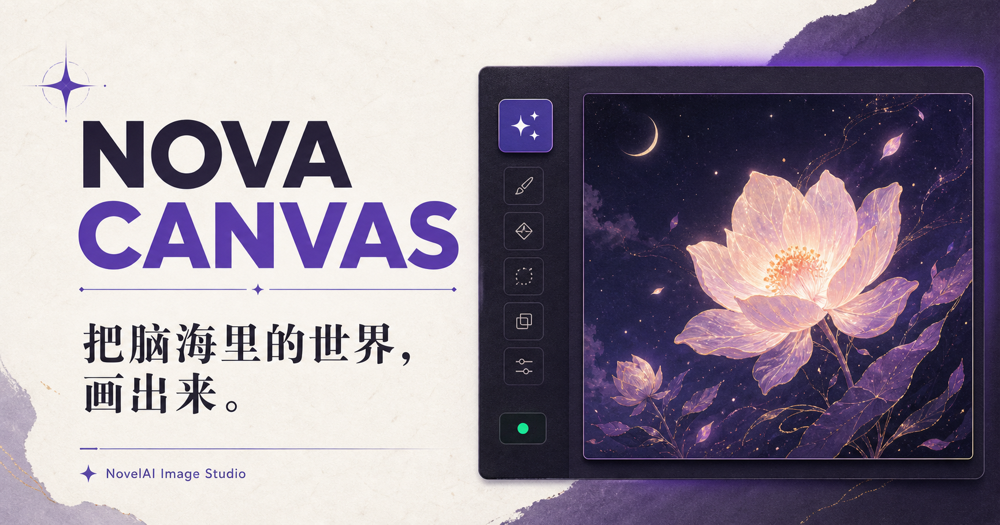

# Nova Canvas

Nova Canvas 是一个面向 NovelAI 的中文图片生成工作台。它提供清晰的参数配置界面，可通过 NovelAI 官方接口或兼容的中转服务生成图片，并在浏览器中预览、管理和下载结果。



## 功能特点

- 支持 NovelAI 官方图片生成接口
- 支持兼容的中转服务地址
- 支持选择模型、尺寸、步数、提示词引导系数等生成参数
- 支持正向提示词与负向提示词
- 在页面内展示生成结果并下载原图
- API Key 仅用于当前生成请求，不写入数据库或浏览器持久存储
- 提供适配桌面端与移动端的中文界面

## 技术栈

- React 19、Next.js 16
- [vinext](https://github.com/cloudflare/vinext) 与 Vite
- Cloudflare Workers / Sites
- TypeScript、ESLint
- Drizzle ORM（预留 D1 数据库支持）

## 环境要求

- Node.js `>= 22.13.0`
- pnpm（推荐）或 npm
- 可用的 NovelAI API Key；使用中转渠道时还需提供兼容的服务地址

## 本地运行

```bash
pnpm install
pnpm dev
```

启动后，根据终端输出在浏览器中打开本地地址。

也可以使用 npm：

```bash
npm install
npm run dev
```

## 使用方法

1. 选择“官方直连”或“中转服务”。
2. 输入 API Key；如果选择中转服务，还需填写服务地址。
3. 编写正向提示词，并按需添加负向提示词。
4. 选择模型、画面尺寸和其他生成参数。
5. 点击“开始生成”，完成后即可预览和下载图片。

中转地址既可以是完整的图片生成端点，也可以是以 `/v1` 结尾的基础地址。

## 常用命令

```bash
# 启动开发服务器
pnpm dev

# 构建生产版本
pnpm build

# 运行构建与页面测试
pnpm test

# 检查代码规范
pnpm lint

# 根据 Drizzle schema 生成迁移
pnpm db:generate
```

## 项目结构

```text
app/                    页面、样式和图片生成 API
app/api/generate/       官方接口与中转服务请求适配
build/                  Sites/Vite 构建插件
db/                     Drizzle 数据库入口与 schema
drizzle/                数据库迁移元数据
examples/d1/            可选的 Cloudflare D1 示例
public/                 静态资源
tests/                  渲染结果测试
worker/                 Cloudflare Worker 入口
.openai/hosting.json    Sites 托管配置
```

## 部署

项目包含 `.openai/hosting.json`，可直接关联 OpenAI Sites 项目。也可以基于 vinext/Cloudflare Workers 的部署流程自行发布。

生产部署前请确认：

- 服务运行环境能够访问所选图片生成接口。
- 不要把 API Key 写入代码、提交到 Git，或记录在服务日志中。
- 只使用你信任的中转服务；中转服务会收到请求中的 API Key 和生成参数。

## 隐私说明

Nova Canvas 不会在应用数据库或浏览器持久存储中保存 API Key。生成请求会经过本项目的服务端路由，再发送到用户选择的官方接口或中转服务。部署者仍应妥善配置日志、网络访问规则和托管平台权限，避免记录敏感请求头或请求正文。

## 相关资料

- [vinext](https://github.com/cloudflare/vinext)
- [Drizzle ORM：Cloudflare D1 指南](https://orm.drizzle.team/docs/get-started/d1-new)
