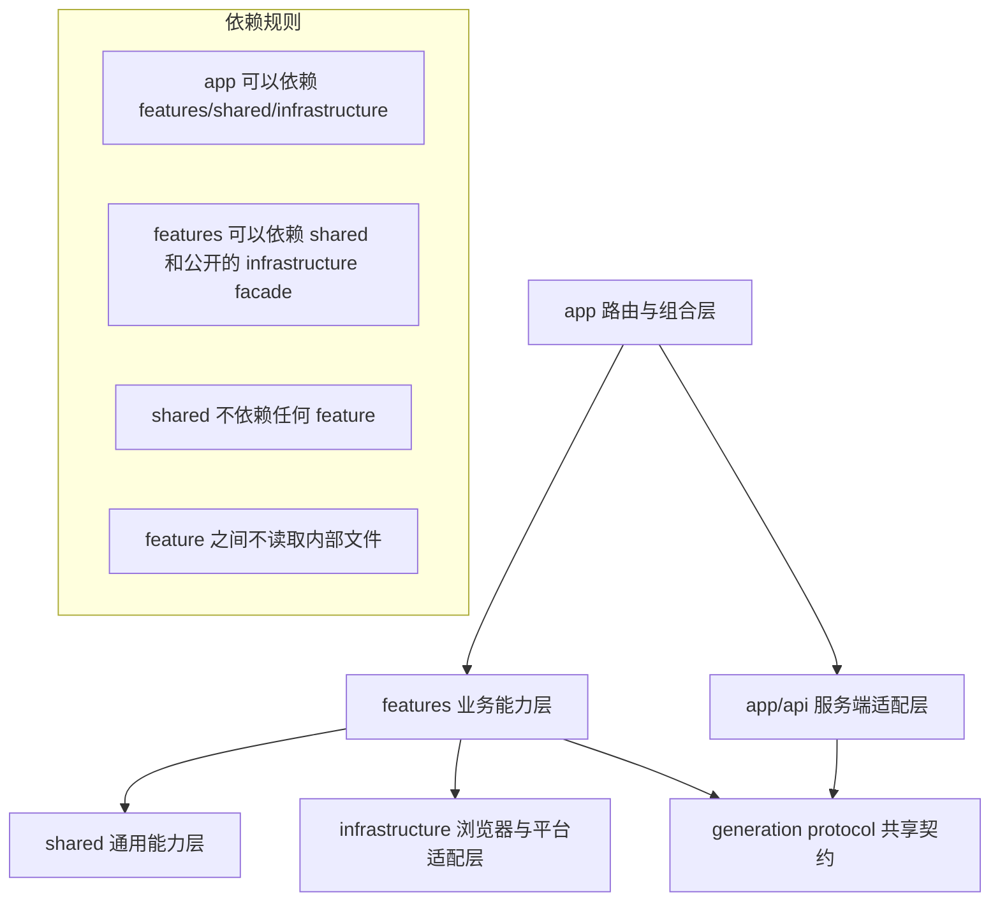

# Nova Canvas 架构重构方案

> 状态：提案  
> 适用范围：Nova Canvas 当前单页工作台  
> 参考项目：`D:\project\onemind-web`  
> 原则：吸收模块边界与代码组织经验，不复制其技术栈、微前端规模或历史复杂度

## 1. 背景与结论

Nova Canvas 当前功能已经形成完整产品闭环，但代码组织仍接近原型阶段：`app/page.tsx` 同时负责表单、生成协议、任务队列、文件存储、收藏、图库和 Lightbox；`app/local-persistence.ts` 同时负责 IndexedDB、File System Access、迁移、缩略图和元数据导出；`app/globals.css` 承载所有页面和组件样式。

本次重构不改变产品功能，也不引入重量级状态管理框架。目标是把现有实现整理成一个适合当前体量的 feature-first 架构，使页面只负责组合，使业务规则可测试，使浏览器基础设施可以替换，并让样式随组件演进。

### 1.1 当前主要问题

| 区域 | 现状 | 风险 |
| --- | --- | --- |
| 页面 | `app/page.tsx` 约 1,563 行，约 39 个 state、12 个 ref | 修改任一功能都可能影响整个工作台 |
| 生成流程 | 参数、队列、请求、重试、文件写入混在 `Home` 中 | 无法单独测试队列和协议，异步状态脆弱 |
| 协议 | 页面和 API Route 分别维护模型、限制和解码逻辑 | 已出现 `imageType` 未定义及规则漂移 |
| 持久化 | 单文件同时处理数据库、目录、图片和迁移 | 接口面过大，UI 直接依赖浏览器细节 |
| 标签超市 | 组件内部混合数据加载、搜索、收藏和 localStorage | 纯业务规则不可复用、不可独立测试 |
| 样式 | 738 行全局 CSS，共享同一类名空间 | 组件改名或删样式需要全局回归 |
| 测试 | 主要通过正则读取源码 | 能防结构删除，不能验证运行行为 |

### 1.2 重构目标

1. `app/page.tsx` 只保留路由入口和工作台组合，目标控制在 80 行以内。
2. 业务按 `generation`、`gallery`、`artist-favorites`、`tag-market`、`storage` 划分。
3. 生成协议在客户端和服务端之间只有一个事实来源。
4. 队列状态转换与浏览器副作用分离，核心 reducer/规则可做纯函数测试。
5. UI 不直接调用 IndexedDB、File System Access 或 `localStorage`。
6. 组件样式默认局部化，全局样式只保留 token、reset 和应用壳布局。
7. 每个迁移阶段都保持产品可运行，可单独提交和回滚。

### 1.3 非目标

- 不迁移出 Next.js/vinext，不替换 Cloudflare 部署链路。
- 不引入微前端、monorepo、DDD 全套模板或新的后端数据库。
- 不为了“目录整齐”拆出只有一行转发代码的文件。
- 不在本轮重新设计 UI，不改变本地优先的数据策略。
- 不直接复制 `onemind-web` 的 `micro-*` 目录、Webpack 配置、全局服务注册或多状态库方案。

## 2. 从 onemind-web 借鉴什么

`onemind-web` 是大型、长期演进的企业应用。它与 Nova Canvas 的规模和技术背景不同，但以下组织方式值得提炼。

### 2.1 借鉴的原则

| onemind-web 中的做法 | Nova Canvas 的轻量化应用 |
| --- | --- |
| 顶层按业务域划分，如 `micro-app`、`micro-canvas`、`eventflowV2` | 使用 `features/generation`、`features/gallery`、`features/tag-market` |
| 业务域内部继续区分 `components`、`hooks`、`store/models`、`utils` | 只在某个 feature 确实需要时建立这些目录 |
| 服务请求集中在 `micro-service/services` | 把官方/relay 请求放到 `features/generation/services` |
| 组件与 `index.less` 或 `*.module.less` 就近维护 | 使用 `Component.tsx + Component.module.css` 共置 |
| 路由定义按模块拆分后聚合 | Next Route 保持薄层，调用共享 protocol/service |
| 复杂数据逻辑由 hooks/models 承担，视图负责展示 | 队列用 hook + reducer，存储通过 facade 注入 |
| 存在依赖分析脚本和明确的构建边界 | 使用 ESLint/import 规则约束 feature 依赖方向 |

参考项目中最适合作为样本的是较小的 `src/micro-template`，而不是体量最大的 `micro-form`：它在一个业务域内同时放置 `components`、`hooks`、`utils`、`constant.js`、`locales` 和 `export`；列表页面负责组合，分页、收藏和插入行为分别由领域 hook 承担。Nova Canvas 将沿用这种垂直切片思想，但只创建当前功能真正需要的目录。

另一个可取之处是公共门面和 adapter：`src/micro-canvas/export` 对路由隐藏内部实现，设计态保存流程用 adapter 把 UI 模型转换为服务端 payload。对应到 Nova Canvas，就是让页面只从 feature 根 `index.ts` 导入，并把生成参数规范化、relay payload 和存储记录转换写成纯函数，而不是散落在组件和请求代码中。

服务层只借鉴“按领域拆薄”的方式。`onemind-web` 的 `micro-service/services/*.js` 将 endpoint 按资源拆开，但其全局 request 也承担登录跳转、解压、解密和全局错误等较多职责。Nova Canvas 不建立类似的万能 request；官方生成、relay 生成和浏览器存储分别保留窄接口。

### 2.2 明确不照搬的部分

1. **不复制微前端粒度。** Nova Canvas 只有一个核心工作台，不需要 `micro-*` 模块或运行/设计双模式。
2. **不复制深层目录。** 目录深度优先控制在 4 层以内；只有多个文件共享明确职责时才建子目录。
3. **不混用多套状态方案。** 当前使用 React reducer/hooks 足够，不同时引入 Zustand、Jotai、MobX 等。
4. **不保留全局与模块样式混用。** 新组件优先 CSS Modules，避免继续扩大 `globals.css`。
5. **不建立万能 `common`。** 代码先留在 feature 内；至少被两个业务域稳定复用后才能进入 `shared`。
6. **不把参考项目的测试现状当作目标。** 它具备 Jest、Testing Library 和别名配置，但有效行为测试较少，CI 也未形成可靠的测试门禁；Nova Canvas 应直接建设真实单元、组件和迁移测试。

## 3. 目标架构

### 3.1 分层模型



各层职责如下：

- `app/`：Next.js 路由、layout、API Route 和页面组合，不承载业务实现。
- `features/`：按用户能力组织业务状态、业务组件、hooks 和服务。
- `infrastructure/`：IndexedDB、文件系统、Canvas、浏览器权限等外部系统适配。
- `shared/`：稳定的通用 UI、类型和纯工具；不得知道具体业务。
- `styles/`：全局 token、reset 和少量布局基线。

### 3.2 建议目录

```text
app/
├─ api/
│  └─ generate/
│     └─ route.ts                 # 薄适配：校验请求、调用 relay client、返回响应
├─ globals.css                    # 暂时保留；逐阶段缩减
├─ layout.tsx
└─ page.tsx                       # 只渲染 <CanvasWorkbench />

features/
├─ workbench/
│  ├─ CanvasWorkbench.tsx         # 页面级组合与视图切换
│  ├─ CanvasWorkbench.module.css
│  └─ index.ts
├─ generation/
│  ├─ components/
│  │  ├─ GenerationForm.tsx
│  │  ├─ GenerationSettings.tsx
│  │  ├─ ConnectionPanel.tsx
│  │  └─ GenerationQueue.tsx
│  ├─ hooks/
│  │  ├─ useGenerationForm.ts
│  │  └─ useGenerationQueue.ts
│  ├─ model/
│  │  ├─ generation.types.ts
│  │  ├─ generation.reducer.ts
│  │  └─ generation.selectors.ts
│  ├─ services/
│  │  ├─ official-generation.client.ts
│  │  └─ relay-generation.client.ts
│  ├─ protocol/
│  │  ├─ generation.constants.ts
│  │  ├─ generation.schema.ts
│  │  └─ image-response.ts
│  └─ index.ts                    # feature 的唯一公共出口
├─ gallery/
│  ├─ components/
│  │  ├─ ResultsCanvas.tsx
│  │  ├─ ImageGrid.tsx
│  │  ├─ ImageCard.tsx
│  │  ├─ LazyImage.tsx
│  │  └─ ImageLightbox.tsx
│  ├─ hooks/
│  │  └─ useImagePreview.ts
│  ├─ model/
│  │  └─ gallery.types.ts
│  └─ index.ts
├─ artist-favorites/
│  ├─ components/
│  │  ├─ ArtistThreadGrid.tsx
│  │  ├─ ArtistThreadCard.tsx
│  │  └─ ArtistThreadDetail.tsx
│  ├─ model/
│  │  └─ artist-thread.ts
│  └─ index.ts
├─ tag-market/
│  ├─ components/
│  │  ├─ TagMarketDialog.tsx
│  │  ├─ TagDatasetTabs.tsx
│  │  ├─ TagDirectoryTree.tsx
│  │  └─ TagGrid.tsx
│  ├─ hooks/
│  │  └─ useTagMarket.ts
│  ├─ model/
│  │  ├─ tag-market.types.ts
│  │  ├─ tag-market.query.ts
│  │  └─ prompt-tags.ts
│  ├─ services/
│  │  └─ tag-catalog.client.ts
│  └─ index.ts
└─ storage/
   ├─ hooks/
   │  └─ useGenerationStorage.ts
   ├─ generation-storage.ts       # 面向业务的 facade/interface
   └─ index.ts

infrastructure/
├─ browser-storage/
│  ├─ indexed-db.ts
│  ├─ settings.repository.ts
│  └─ generations.repository.ts
├─ file-system/
│  ├─ directory.adapter.ts
│  ├─ generation-files.repository.ts
│  └─ metadata-file.ts
├─ images/
│  ├─ image-codec.ts
│  └─ thumbnail.ts
└─ index.ts

shared/
├─ ui/
│  ├─ Button/
│  ├─ StatusPill/
│  └─ VisuallyHidden/
├─ lib/
│  ├─ clipboard.ts
│  └─ async.ts
└─ types/
   └─ utility.ts

styles/
├─ tokens.css
├─ reset.css
└─ globals.css

tests/
├─ unit/
├─ integration/
└─ rendered-html.test.mjs         # 迁移期保留，之后逐步降权
```

这是一张目标地图，不要求第一批提交就创建所有目录。只有代码实际迁入时才创建对应文件。

### 3.3 公开边界

每个 feature 通过 `index.ts` 公开最小 API，外部不得跨目录读取内部实现。例如：

```ts
// features/generation/index.ts
export { GenerationForm } from "./components/GenerationForm";
export { GenerationQueue } from "./components/GenerationQueue";
export { useGenerationQueue } from "./hooks/useGenerationQueue";
export type { GenerationParams, GenerationTask } from "./model/generation.types";
```

不建议在每一层都创建 barrel 文件。只在 feature 根目录设置公共出口，避免循环依赖和无法追踪的导出链。

### 3.4 依赖方向

允许：

```text
app -> features -> infrastructure/shared
app/api -> generation/protocol
gallery -> storage 的公开 facade
artist-favorites -> gallery 的公开类型或共享 GenerationId
```

禁止：

```text
infrastructure -> React 组件
shared -> features
generation -> gallery 内部组件
tag-market -> workbench 内部 state
任意模块 -> 另一个 feature 的 internal 文件
```

`features/storage` 是面向业务的接口层，`infrastructure/*` 是具体实现。这样 UI 测试可以注入内存版本，而不必真实打开 IndexedDB 或申请目录权限。

## 4. 核心模块设计

### 4.1 生成协议：单一事实来源

优先抽取当前客户端与 API Route 重复的内容：

- 支持的模型和默认模型；
- 尺寸选项；
- prompt、steps、scale、seed、sampler 的限制；
- `GenerateRequest`、上游 JSON 响应类型；
- base64 解码与 MIME 判断；
- relay URL 标准化和请求 payload 组装。

建议区分纯协议和运行时 client：

```ts
export type GenerationParams = {
  model: ModelId;
  size: ImageSize;
  prompt: string;
  negativePrompt: string;
  steps: number;
  scale: number;
  sampler: SamplerId;
  seed: number;
};

export function validateGenerationParams(input: unknown): ValidationResult;
export function detectImageMimeType(name: string, bytes: Uint8Array): string;
export function buildRelayPayload(params: GenerationParams): RelayPayload;
```

客户端与 Route 可以共享常量、类型和纯函数，但不能让客户端 import 只在 Worker 可用的实现。

### 4.2 任务队列：状态机与副作用分离

`useGenerationQueue` 负责 React 集成，`generation.reducer.ts` 只负责状态转换：

```text
pending -> running -> done
                   -> retry_wait -> pending
                   -> failed
pending/running -> cancelled
```

副作用由注入的 runner 执行：

```ts
type GenerationRunner = (
  params: GenerationParams,
  signal: AbortSignal,
) => Promise<GeneratedAsset>;
```

队列不知道请求是官方还是 relay，也不知道图片最终写入 IndexedDB 还是本地目录。任务完成后通过明确的 callback/application service 保存结果。这样并发上限、取消、重试和进度可以单测。

### 4.3 存储：用 facade 隔离浏览器能力

业务层只依赖：

```ts
export interface GenerationStorage {
  loadAll(): Promise<StoredGeneration[]>;
  save(result: PersistableGeneration): Promise<StoredGeneration>;
  clearMetadata(): Promise<void>;
  loadPreview(record: StoredGeneration): Promise<ImagePreview>;
  exportMetadata(records: StoredGeneration[]): Promise<void>;
  inspectLegacyData(): Promise<LegacyDataSummary>;
  migrateLegacyData(onProgress: (value: MigrationProgress) => void): Promise<void>;
}
```

实现内部再组合：

- `generations.repository.ts`：IndexedDB metadata CRUD；
- `settings.repository.ts`：目录句柄、收藏和本地设置；
- `generation-files.repository.ts`：原图和缩略图读写；
- `thumbnail.ts`：Canvas/ImageBitmap 编解码；
- `metadata-file.ts`：`nova-canvas.json` 同步。

不要让 repository 互相 import UI 类型。持久化记录类型属于 storage contract，UI view model 在 gallery 内映射。

### 4.4 Gallery 与 Lightbox

把 `LazyImage` 独立出来是第一步，但它不应自行知道整个页面状态。建议 props 保持明确：

```ts
type LazyImageProps = {
  imageId: GenerationId;
  filename: string;
  alt: string;
  previewLoader: PreviewLoader;
  className?: string;
};
```

Lightbox 的索引、缩放、位移和键盘事件放入 `useLightbox` 或组件自身；切换图片时直接在事件/reducer 中重置视图，避免 effect 同步触发多次 state 更新。

### 4.5 Tag Market

以下逻辑应成为纯函数：

- `directoryPath`、`completePath`；
- 路径比较和子目录构建；
- 搜索与数据集过滤；
- prompt tag 解析、加入和移除。

`TagMarketDialog` 只接收当前 prompt 和命令式回调；catalog fetch 与收藏存储由 hook/service 提供。7.3 MB catalog 后续可进一步按 dataset 拆分或建立轻量索引，但这不是本轮结构重构的阻塞项。

### 4.6 样式策略

1. `tokens.css` 保存颜色、阴影、间距、圆角、z-index 和断点语义。
2. `reset.css` 保存元素 reset、基础字体和 focus baseline。
3. `globals.css` 只组合上述文件及应用壳必要规则。
4. feature 组件使用 `*.module.css`，文件与组件共置。
5. 动态值通过 CSS custom property 传入，避免大段 inline style：

```tsx
<div
  className={styles.stage}
  style={{ "--zoom": zoom, "--pan-x": `${x}px`, "--pan-y": `${y}px` } as React.CSSProperties}
/>
```

迁移期间允许旧类名和 CSS Module 共存；每拆一个组件就迁走对应 CSS，最终再清理全局文件。不要一次性重写 738 行样式。

## 5. 旧代码迁移映射

| 当前代码 | 目标位置 |
| --- | --- |
| `page.tsx` 的 models、sizes、limits | `features/generation/protocol/*` |
| prompt 拼接、规范化 | `features/generation/model/prompt.ts` |
| `enqueueGeneration`、`runTask`、取消与重试 | `useGenerationQueue` + reducer + clients |
| 左侧表单 JSX | `GenerationForm`、`GenerationSettings`、`ConnectionPanel` |
| 队列条 JSX | `GenerationQueue` |
| `LazyImage`、preview cache | `features/gallery/*` |
| `renderImageCard` | `ImageCard` |
| Lightbox 状态和 JSX | `ImageLightbox` / `useLightbox` |
| artist thread 计算与收藏 | `features/artist-favorites/*` |
| `tag-market.tsx` | `features/tag-market/components/*` |
| `tag-market-data.ts` | `tag-market/model` + `tag-catalog.client.ts` |
| IndexedDB CRUD | `infrastructure/browser-storage/*` |
| 文件夹读写 | `infrastructure/file-system/*` |
| thumbnail/canvas | `infrastructure/images/*` |
| `globals.css` 对应组件段落 | 各组件 `*.module.css` |

## 6. 分阶段实施计划

### 阶段 0：建立安全基线

目的：先让重构拥有可信反馈。

任务：

1. 使用 Node.js `>=22.13.0` 固定本地和 CI 环境。
2. 修复 Route 中未定义的 `imageType`。
3. 补齐 Cloudflare Worker 类型，或从默认 TypeScript include 中隔离未启用的 D1 示例。
4. 让 `pnpm lint`、`pnpm exec tsc --noEmit`、`pnpm test` 全部通过。
5. 为当前关键路径增加最小行为测试：参数校验、prompt 拼接、relay URL、图片 MIME。

验收标准：

- 三条检查命令稳定通过；
- 不改变 UI 和生成结果；
- 当前错误被测试覆盖，而不是只做局部消警。

### 阶段 1：抽取共享协议与纯函数

目的：先移动无 React 状态的低风险代码。

任务：

1. 创建 `features/generation/protocol` 和 `model`。
2. 合并页面与 API Route 的模型、限制、类型及图片解码逻辑。
3. 抽取 prompt、artist thread key 和 TagMarket 查询纯函数。
4. 为每个纯函数添加单元测试。

验收标准：

- 页面和 Route 不再重复维护模型/限制；
- API Route 不再引用页面中的实现；
- 所有纯函数不访问 React、DOM、IndexedDB 或 `window`。

### 阶段 2：拆分展示组件与样式

目的：降低 JSX 和全局 CSS 的体积，不先改变状态所有权。

推荐顺序：

1. `StatusPill`、`ImageCard`、`ArtistThreadCard` 等叶子组件；
2. `ImageLightbox`、`GenerationQueue`；
3. `GenerationForm`、`ConnectionPanel`；
4. `ResultsCanvas` 和 `CanvasWorkbench`。

本阶段状态仍可由 `Home/CanvasWorkbench` 持有，通过显式 props 传递。先建立组件边界，再迁移状态，避免同一个提交同时改变 UI 结构和业务行为。

验收标准：

- `app/page.tsx` 只渲染 `CanvasWorkbench`；
- 不再存在 `renderImageCard`、`renderFavoriteThreadCard` 闭包；
- 每个新组件有局部样式或明确依赖的 shared primitive；
- 响应式、键盘操作和 reduced-motion 行为不退化。

### 阶段 3：抽取队列和生成 clients

目的：把最复杂的异步业务从页面中移出。

任务：

1. 用 reducer 表达 task 生命周期。
2. 创建 official 和 relay generation client。
3. 在 `useGenerationQueue` 中编排并发、AbortController、重试计时器和进度。
4. 通过 callback/application service 处理生成成功后的保存。
5. 删除 `imagesRef`、`directoryRef` 等由页面承担的 mutable bridge，或将必要 ref 封装在 hook 内。

验收标准：

- 队列 reducer 有完整状态转换测试；
- 可测试并发上限、取消和限流重试；
- 生成 client 不 import React；
- 页面组件不直接调用 NovelAI 或 `/api/generate`。

### 阶段 4：拆分存储基础设施

目的：让业务只看到 `GenerationStorage`。

任务：

1. 先为旧 `local-persistence.ts` 建 facade，保持实现不动。
2. UI 全部切换到 facade/hook 后，再逐块迁出 IndexedDB、文件系统和图片逻辑。
3. 保留旧数据库名、object store、文件名和 `nova-canvas.json` 格式。
4. 使用兼容性 fixture 覆盖旧记录和 legacy blob 迁移。
5. 最后删除旧聚合文件。

验收标准：

- 既有本地记录不丢失；
- 旧图片迁移、缩略图 fallback、目录权限恢复均通过测试；
- React 组件中不出现 `indexedDB`、`showDirectoryPicker` 或文件句柄细节。

### 阶段 5：重构 Tag Market 与收藏

目的：隔离两个相对独立的业务域。

任务：

1. 拆分 TagMarket 查询模型、catalog client 和收藏 repository。
2. 拆分 artist thread selectors、收藏 repository 和展示组件。
3. 用显式 command/API 连接 workbench，避免子组件直接推断外部状态。
4. 评估 catalog 是否需要按数据集懒加载；只有性能数据证明必要时实施。

验收标准：

- 目录浏览、搜索、收藏、自定义标签均有行为测试；
- TagMarket 关闭再打开仍保持预期状态；
- artist thread 封面与旧收藏数据完全兼容。

### 阶段 6：收尾与边界治理

任务：

1. 清理未使用 CSS、旧导出和重复类型。
2. 将 `globals.css` 缩减为 token/reset/shell。
3. 添加依赖边界规则，禁止 feature 深层互相 import。
4. 更新 README 的项目结构、测试说明和架构决策。
5. 记录关键 ADR：本地优先存储、官方直连、队列并发、feature-first 目录。

验收标准：

- 没有循环依赖；
- 无未使用样式和失效兼容层；
- 新增功能可以明确落到一个 feature 内，而不需要修改页面巨型组件。

## 7. 建议的提交/PR 切分

每个 PR 只承担一种变化：

1. `fix: restore typecheck and lint baseline`
2. `refactor: centralize generation protocol`
3. `refactor: extract gallery leaf components`
4. `refactor: extract generation controls`
5. `refactor: introduce generation queue reducer`
6. `refactor: isolate generation clients`
7. `refactor: add storage facade`
8. `refactor: split browser storage adapters`
9. `refactor: modularize tag market`
10. `refactor: migrate component styles and enforce boundaries`

一次 PR 不同时进行大规模重命名、状态迁移和视觉调整。纯移动提交与行为修改提交尽量分开，便于审查和 `git bisect`。

## 8. 测试策略

### 8.1 单元测试

- generation 参数规范化与校验；
- prompt 拼接、tag toggle、artist key；
- queue reducer 的所有状态转换；
- relay URL 和 payload；
- MIME/base64/zip 响应解析；
- TagMarket 路径树、搜索和过滤；
- storage record 兼容性转换。

### 8.2 组件测试

- GenerationForm 的输入与提交；
- Queue 的状态、取消和清理；
- ImageLightbox 的键盘、切图、缩放；
- TagMarket 的目录导航与收藏；
- ArtistThread 的封面选择。

### 8.3 集成测试

- 官方/relay client 使用 mock fetch；
- fake IndexedDB 下的 metadata CRUD；
- 内存 file adapter 下的保存、缩略图和迁移；
- 队列完成后保存并更新 gallery 的完整链路。

现有源码正则测试可在迁移期保留，但新行为不再依赖正则测试证明正确。待组件测试覆盖稳定后，删除只约束内部实现细节的断言。

## 9. 风险与控制措施

| 风险 | 控制措施 |
| --- | --- |
| 本地旧数据损坏 | 不修改数据库/store/file schema；使用真实旧数据 fixture 做迁移测试 |
| Blob URL 泄漏或过早 revoke | 为 preview loader 建立生命周期测试，保持缓存与 revoke 责任唯一 |
| 队列行为变化 | 先写 reducer characterization tests，再迁移实现 |
| 大量 props drilling | 先接受显式 props；只有稳定共享状态确实跨越多层时才引入局部 Context |
| 目录过度设计 | 按需建目录；单文件能力不强制拆成 components/hooks/model 三件套 |
| CSS 迁移造成视觉回归 | 逐组件迁移，保留旧选择器直到新组件完成截图/人工回归 |
| feature 循环依赖 | 公共 ID/DTO 下沉到 contract/shared；禁止跨 feature 深层 import |

## 10. 完成定义

满足以下条件时，本轮架构重构可以结束：

- `app/page.tsx` 是薄路由入口；
- 页面没有直接的网络、IndexedDB 或文件系统调用；
- 生成协议、模型和限制只有一份定义；
- 队列、存储、TagMarket 查询均可独立测试；
- 主业务组件拥有局部样式，`globals.css` 不再承载 feature 细节；
- TypeScript、ESLint、单元测试和构建全部通过；
- 旧 IndexedDB、目录图片、缩略图、收藏与 metadata 文件保持兼容；
- README 与实际目录一致，后续开发者能根据业务能力快速定位代码。

## 11. 推荐立即执行的第一批工作

第一批控制在低风险范围内：

1. 修复当前类型检查与 lint 基线；
2. 抽取 generation protocol、prompt 工具和对应测试；
3. 抽取 `ImageCard`、`ArtistThreadCard`、`GenerationQueue` 三个展示组件；
4. 组件状态暂时仍由原页面持有，不迁移存储格式；
5. 对比重构前后的生成、取消、下载、收藏和旧数据加载行为。

完成后再根据实际 props 和状态流决定 `CanvasWorkbench`、queue hook 与 storage facade 的最终接口。这样架构来自真实依赖，而不是预先套用模板。

## 12. 实施记录

### 2026-08-07：第一步最小安全重构

已完成：

- 新增 `features/generation/protocol/image-response.ts`，集中提供 `decodeBase64Image` 和 `detectImageMimeType`；该模块只依赖浏览器与 Edge runtime 都支持的 Web API。
- `app/page.tsx` 改为使用共享图片响应工具，移除页面内重复的 base64 解码和 MIME 判断实现。
- `app/api/generate/route.ts` 改为使用共享工具，并以 `detectImageMimeType` 替换原未定义的 `imageType`，修复该类型检查错误来源。
- `tests/rendered-html.test.mjs` 增加客户端、Route 与共享协议之间的回归断言，并直接验证 base64 解码及 WebP/JPEG/PNG MIME 判断行为。

本次未做：

- 未拆分 `Home`、生成队列、图库、持久化或 TagMarket 组件与状态。
- 未改变 API 请求格式、图片响应格式、IndexedDB/文件系统 schema 或 CSS。
- 未处理本轮范围之外的 Worker/D1 类型、Node 版本或其他 lint 告警。

验证结果：

- `pnpm exec tsc --noEmit --incremental false --target ES2017 --lib 'dom,dom.iterable,esnext' --module esnext --moduleResolution bundler --strict --skipLibCheck features/generation/protocol/image-response.ts app/api/generate/route.ts`：通过；完整 `pnpm exec tsc --noEmit` 仍被仓库既有的 Cloudflare 类型缺失阻断：`db/index.ts` 找不到 `cloudflare:workers`，`worker/index.ts` 找不到 `Fetcher`/`D1Database`。
- 使用工作区 Node 24 运行目标文件 ESLint：共享协议和 Route 未产生新问题；检查仍因 `app/page.tsx` 既有的 Lightbox effect 同步 setState 报 1 个错误，并保留 2 个 `` 性能告警。
- 使用工作区 Node 24 运行 `node --test tests/rendered-html.test.mjs`：新增的共享图片响应结构与行为测试通过；全量文件中有 4 条既有源码断言失败（Lightbox/favorites 样式断言），与本次改动无关。
